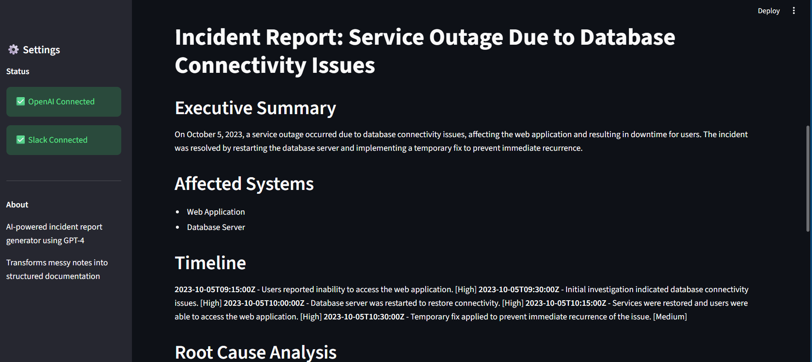
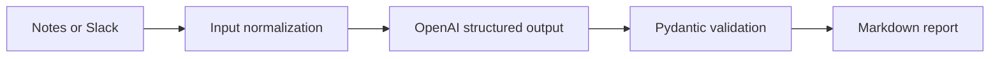

# Incident Copilot

An AI-assisted incident reporting application that turns messy ticket notes or Slack incident conversations into validated, structured post-incident reports.



## What it produces

- Executive summary and affected systems
- Timestamped incident timeline
- Root-cause hypothesis clearly separated from confirmed facts
- Impact and resolution summaries
- Prioritized action items with owners and estimates when available
- Missing-information checklist to prevent confident guesses
- Downloadable Markdown reports

## Interfaces

| Interface | Best for |
| --- | --- |
| Streamlit | Pasting notes, importing a Slack channel, and reviewing reports visually |
| CLI | Local files, automation, and repeatable demonstrations |

## Architecture



The model does not directly write the final document. Its response must first pass the `IncidentReport` Pydantic schema, which constrains priorities, timeline severity values, and required sections.

## Quick start

```bash
git clone https://github.com/Toddni8022/incident-copilot.git
cd incident-copilot
python -m venv .venv
source .venv/bin/activate  # Windows: .venv\Scripts\activate
pip install -r requirements.txt
cp .env.example .env
streamlit run app.py
```

For the command line:

```bash
python main.py examples/sample_ticket.txt
```

Reports are written to `output/` by default.

## Configuration

| Variable | Required | Description |
| --- | --- | --- |
| `OPENAI_API_KEY` | Yes | OpenAI API key |
| `MODEL` | No | Structured-output compatible model |
| `SLACK_BOT_TOKEN` | Only for Slack | Bot token with permission to read the selected channel |
| `OUTPUT_DIR` | No | Report directory; defaults to `output` |
| `TEMPERATURE` | No | Sampling temperature; defaults to `0.3` |
| `LOG_LEVEL` | No | Python logging level |

The Slack bot must be explicitly invited to a channel. Use the minimum scopes required for your workspace, and never commit tokens.

## Test and quality checks

```bash
pip install -r requirements-dev.txt
pytest -q
```

GitHub Actions runs compilation and unit tests on every push and pull request. Tests do not call OpenAI or Slack.

## Responsible use

- Treat root cause as a hypothesis until evidence confirms it.
- Review generated reports before they enter an ITSM or compliance system.
- Redact credentials, personal data, and other sensitive content before using external APIs.
- Slack import is opt-in and limited to the channel and message count selected by the operator.

## Limitations

This is a portfolio-scale application, not a replacement for PagerDuty, ServiceNow, or an enterprise evidence store. It does not currently resolve Slack user IDs to names, ingest message threads, or calculate incident metrics from monitoring systems.

## License

MIT
